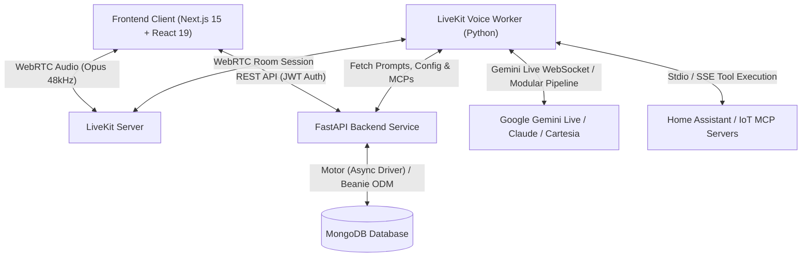

# Home Assistant — LiveKit Voice Agent App

## Requirements & Architecture Specification (v0.3)

## 1. Executive Overview

A self-hosted, personal AI home assistant delivered as a high-performance responsive web application. Users converse with an autonomous voice agent (**Exia**) via a bidirectional WebRTC audio interface powered by LiveKit and Google Gemini Live (or modular STT/LLM/TTS). The app also serves as a centralized mission control hub for managing conversational history, Model Context Protocol (MCP) server tools, reusable directives, speech pipeline parameters, and security credentials.



---

## 2. Frontend Implementation (Completed Status)

The frontend application has been fully structured, aesthetically enhanced, and verified across both desktop and mobile viewports:

### 2.1 Brand & Visual Identity

- **Exia  Tactical Interface**: Mecha-inspired tactical aesthetic featuring signature GN Emerald (`#10b981`) conduits, clean telemetry indicators, and typography powered by **Public Sans** and **Commit Mono**.
- **Branded Assets**: High-resolution Exia avatar and logo assets in `public/images/`.
- **Favicon & Turbopack Crash Fix**: Replaced the default LiveKit starter icon and resolved Next.js 15 Turbopack ICO RGBA format decoding crashes by placing a multi-resolution static favicon (`16x16`, `32x32`, `48x48`, `256x256`) at `public/favicon.ico` with high-res PNG touch icons and explicit `<link rel="icon">` declarations in `app/layout.tsx`.
- **Repository Hygiene & Cleanup**: Removed unused starter template components (`components/ui/button-group.tsx`, `components/ui/separator.tsx`, `components/ui/tooltip.tsx`), obsolete starter SVGs (`lk-logo-dark.svg`, `lk-logo-light.svg`, `lk-wordmark.svg`), unused italic font binaries, and redundant root config files (`taskfile.yaml`, `renovate.json`, `.eslintrc.json`).

### 2.2 Dual-Theme Engine (Solar Light & Tactical Dark)

- **Tailwind CSS v4 Dark Variant**: Configured standard class-based variant mapping: `@custom-variant dark (&:where(.dark, .dark *));`.
- **Complete Elimination of Hardcoded Colors**: Conducted a comprehensive audit across all views (`login-view.tsx`, `settings-view.tsx`, `history-view.tsx`, `prompts-view.tsx`, `model-selection-view.tsx`, `voice-stage.tsx`, `app-shell.tsx`, `sidebar.tsx`). Removed all hardcoded `text-white`, `bg-black/*`, and `border-white/*` declarations in favor of semantic design tokens:
  - **Solar Light Mode**: Crisp slate surfaces (`#f8fafc`), deep charcoal text (`#090d16`), emerald-600 accents, muted subtle containers (`bg-muted/40`), and clean borders (`#e2e8f0`).
  - **Tactical Dark Mode**: Deep space `#07090e` surfaces, high-contrast `#f1f5f9` text, `#0c1017` card containers, and glowing GN emerald highlights.
- **Relocated Theme Switcher**: Replaced the cramped switcher in the sidebar with a hydration-safe segmented pill switcher (`components/app/theme-toggle.tsx`) positioned in the global top header (`AppShell`) and mirrored in the Settings view.

### 2.3 Collapsible Navigation with Edge Hover Trigger

- **Smooth Collapsible Sidebar**: Desktop navigation sidebar with 300ms cubic transition, accessible toggle buttons in both top header and sidebar header, keyboard shortcut (**Ctrl+B** / **Cmd+B**), and state persistence via `localStorage ('exia_sidebar_open')`.
- **Left-Edge Hover Arrow Trigger**: When the sidebar is collapsed or hidden, hovering near the left edge of the viewport smoothly slides out an illuminated emerald tab with an animated chevron ("Menu") that expands the navigation back open with a single click.
- **Mobile Floating Dock**: Responsive bottom navigation dock (`MobileNav`) for seamless one-handed mobile phone usage.

### 2.4 Resilient API Layer & Runtime Reliability

- **Standardized Client (`frontend/lib/api.ts`)**: Strongly typed services for `auth`, `livekit`, `sessions`, `mcp`, `prompts`, and `models` with method aliases supporting both singular/plural and verb conventions (`getPrompts`, `createPrompt`, `api.model`).
- **React 19 Runtime Fix**: Added missing `useEffect` lifecycle hook to `components/app/app.tsx` for automatic LiveKit session cleanup (`api.livekit.endSession`) upon disconnect.
- **Offline / Mock Fallback Store**: Automatically falls back to localized mock data when the FastAPI backend is offline, allowing complete UI development and testing without runtime errors.

### 2.5 Implemented Views Summary

| Screen | Tab ID | Key Features & Components |
| --- | --- | --- |
| **Voice Stage** | `session` | Live WebRTC audio interface via LiveKit client SDK, pulsating animated visualizer halo, start/disconnect controls, real-time message transcript bubbles, network connection indicators, and adaptive noise cancellation status. |
| **Session History** | `history` | Bento Grid telemetry cards (*Total Sessions*, *Voice Airtime*, *Avg TTFT Latency*, *MCP Tool Actions*), search input, model filters (*All*, *Gemini Live*, *Modular*), transcript log cards with duration & tool counts, slide-over detail drawer with simulated audio playback, and raw JSON telemetry viewer. |
| **MCP Registry** | `mcp` | Local `stdio` and remote `sse` server management, connection status badges (*Active*, *Connecting*, *Offline*), server ping/testing action, 1-click catalog presets (*Home Assistant REST*, *Filesystem*, *SQLite*, *Weather*, *Brave Search*), and create/edit modal. |
| **Directive Matrix** | `prompts` | Live agent directive spotlight banner, curated presets (*Tactical Guardian*, *Minimalist Assistant*, *Home Diagnostic Macro*, *Night Patrol Mode*), custom CRUD modal with dynamic variable pills (`{user_name}`, `{current_time}`, `{home_temp}`, `{security_status}`, `{active_room}`), and clipboard copy. |
| **Model Engine** | `models` | Dual pipeline architecture selection (*Gemini Live speech-to-speech* vs. *Modular STT/LLM/TTS*), model picker (*Gemini 2.0 Flash*, *Flash Thinking*), voice timbre selector (*Charon*, *Puck*, *Kore*, *Fenrir*, *Aoede*), live response temperature & token length range sliders, and multi-vendor component dropdowns (*Deepgram Nova-2*, *Claude 3.5 Sonnet*, *Cartesia Sonic*). |
| **Settings & Security** | `settings` | Authenticated operator profile card, audio DSP filter toggles (*Acoustic Echo Cancellation*, *AI Noise Suppression*, *Auto Gain Control*), visualizer style switcher (*Aura*, *Wave*, *Bar*, *Radial*), GN accent scheme picker, display theme mode selector, and password change form with real-time strength meter. |
| **Tactical Access (Auth)** | N/A | Full login screen with email/username and passkey, live validation, quick test credential buttons (*Commander Admin*, *Guest Operator*), and automatic redirect upon token grant. |

---

## 3. Backend Requirements (FastAPI Specification)

The backend must be built using **FastAPI** (Python 3.11+) with **MongoDB** via **Motor** (the official async MongoDB driver) or **Beanie ODM** (async MongoDB ODM built on Pydantic v2). All API routes are prefixed under `/api`.

### 3.1 Authentication & Operator Gateway (`/api/auth`)

#### `POST /api/auth/login`

- **Description**: Authenticates operator credentials using bcrypt/argon2 and issues JWT access and refresh tokens.
- **Request Body**:

  ```json
  {
    "email": "commander@homeassistant.local",
    "password": "SecurePassword123!"
  }
  ```

  *(Accepts `email_or_username` or `username` as fallback fields)*
- **Success Response (`200 OK`)**:

  ```json
  {
    "access_token": "eyJhbGciOiJIUzI1NiIsInR5cCI6IkpXVCJ9...",
    "refresh_token": "eyJhbGciOiJIUzI1NiIsInR5cCI6IkpXVCJ9...",
    "token_type": "bearer",
    "user": {
      "id": "usr_94b1c2fa",
      "email": "commander@homeassistant.local",
      "name": "Commander",
      "role": "superuser",
      "created_at": "2026-09-19T00:00:00Z"
    },
    "message": "Authentication successful"
  }
  ```

- **Error Responses**: `400 Bad Request` (Malformed payload), `401 Unauthorized` (Invalid credentials).

#### `POST /api/auth/logout`

- **Description**: Terminates active session, revoking or blacklisting the active token.
- **Headers**: `Authorization: Bearer <access_token>`
- **Success Response (`200 OK`)**:

  ```json
  {
    "success": true,
    "message": "Session terminated successfully"
  }
  ```

#### `GET /api/auth/me`

- **Description**: Returns authenticated user profile and permissions.
- **Headers**: `Authorization: Bearer <access_token>`
- **Success Response (`200 OK`)**:

  ```json
  {
    "id": "usr_94b1c2fa",
    "email": "commander@homeassistant.local",
    "name": "Commander",
    "role": "superuser",
    "created_at": "2026-09-19T00:00:00Z"
  }
  ```

- **Error Response**: `401 Unauthorized`.

#### `POST /api/auth/change-password`

- **Description**: Changes operator password after verifying current password.
- **Headers**: `Authorization: Bearer <access_token>`
- **Request Body**:

  ```json
  {
    "current_password": "OldPassword123!",
    "new_password": "NewSecurePassword456!"
  }
  ```

- **Success Response (`200 OK`)**:

  ```json
  {
    "success": true,
    "message": "Password successfully updated"
  }
  ```

- **Error Responses**: `400 Bad Request` (Password does not meet complexity rules), `401 Unauthorized` (Current password incorrect).

---

### 3.2 LiveKit Room & Token Minting (`/api/livekit` & `/api/agent`)

#### `POST /api/livekit/token` (or `POST /api/agent/token`)

- **Description**: Creates or binds a LiveKit room, generates an AccessToken with participant grants (join, publish audio, subscribe, data channels), and dispatches the voice worker agent.
- **Headers**: `Authorization: Bearer <access_token>`
- **Request Body** *(Optional)*:

  ```json
  {
    "room_name": "exia-room-sess-101"
  }
  ```

- **Success Response (`200 OK`)**:

  ```json
  {
    "server_url": "wss://livekit.homeassistant.local",
    "token": "eyJhbGciOiJIUzI1NiIsInR5cCI6IkpXVCJ9...",
    "session_id": "sess-a1f94082",
    "room_name": "exia-room-sess-101"
  }
  ```

- **Backend Mechanics**:
  1. Mint token using `livekit.api.AccessToken(api_key, api_secret)`.
  2. Embed participant grants: `VideoGrants(room_join=True, room=room_name, can_publish=True, can_subscribe=True, can_publish_data=True)`.
  3. Create an initial session record in database with status `in_progress`.
  4. Dispatch agent worker via LiveKit Job/Room API or agent dispatch queue.

#### `POST /api/sessions/{id}/end` (or `POST /api/livekit/end-session`)

- **Description**: Finalizes session, marks status as `ended`, calculates duration, and triggers background persistence of turn transcripts and MCP tool execution records.
- **Headers**: `Authorization: Bearer <access_token>`
- **Path Parameter**: `id` (Session UUID or ID string)
- **Request Body** *(Optional)*:

  ```json
  {
    "session_id": "sess-a1f94082"
  }
  ```

- **Success Response (`200 OK`)**:

  ```json
  {
    "success": true,
    "duration_seconds": 142,
    "message": "Session closed"
  }
  ```

---

### 3.3 Session History & Telemetry (`/api/sessions`)

#### `GET /api/sessions`

- **Description**: Returns paginated list of previous conversational sessions with summary telemetry.
- **Headers**: `Authorization: Bearer <access_token>`
- **Query Parameters**:
  - `page`: Integer (default `1`)
  - `limit`: Integer (default `10`)
  - `search`: String (optional keyword search in preview or transcripts)
  - `model`: String (optional filter: `all`, `gemini_live`, `modular`)
- **Success Response (`200 OK`)**:

  ```json
  {
    "total": 42,
    "page": 1,
    "limit": 10,
    "sessions": [
      {
        "id": "sess-101",
        "user_id": "usr_94b1c2fa",
        "room_name": "room-morning-brief",
        "started_at": "2026-09-19T07:15:00Z",
        "ended_at": "2026-09-19T07:18:04Z",
        "status": "ended",
        "duration_seconds": 184,
        "model_used": "Gemini Live (Charon)",
        "message_count": 6,
        "preview_text": "Good morning! You have 3 tasks today, starting with Sprint Planning at 10 AM.",
        "mcp_tools_count": 2
      }
    ]
  }
  ```

#### `GET /api/sessions/{id}`

- **Description**: Returns complete transcript messages, tool executions, and latency metrics for a session.
- **Headers**: `Authorization: Bearer <access_token>`
- **Path Parameter**: `id`
- **Success Response (`200 OK`)**:

  ```json
  {
    "id": "sess-101",
    "user_id": "usr_94b1c2fa",
    "room_name": "room-morning-brief",
    "started_at": "2026-09-19T07:15:00Z",
    "ended_at": "2026-09-19T07:18:04Z",
    "status": "ended",
    "duration_seconds": 184,
    "model_used": "Gemini Live (Charon)",
    "message_count": 4,
    "preview_text": "Good morning! Living room lights turned on.",
    "transcript": [
      {
        "id": "msg-1",
        "role": "user",
        "text": "Turn on living room lights and set AC to 72.",
        "timestamp": "2026-09-19T07:15:10Z"
      },
      {
        "id": "msg-2",
        "role": "assistant",
        "text": "Done! Living room lights are at 80% and thermostat is set to 72°F.",
        "timestamp": "2026-09-19T07:15:14Z"
      }
    ],
    "mcp_tools_invoked": [
      {
        "id": "tool-1",
        "name": "home_assistant.set_device_state",
        "args": { "entity_id": "light.living_room", "state": "on", "brightness": 80 },
        "result": "OK",
        "status": "success",
        "timestamp": "2026-09-19T07:15:12Z"
      }
    ],
    "metrics": {
      "avg_ttft_ms": 320,
      "audio_codec": "Opus 48kHz stereo",
      "packet_loss_pct": 0.02
    }
  }
  ```

- **Error Response**: `404 Not Found`.

#### `DELETE /api/sessions/{id}`

- **Description**: Permanently deletes a session and cascades deletion to transcripts and tool logs.
- **Headers**: `Authorization: Bearer <access_token>`
- **Path Parameter**: `id`
- **Success Response (`200 OK`)**:

  ```json
  {
    "success": true,
    "message": "Session record deleted"
  }
  ```

---

### 3.4 Model Context Protocol (MCP) Server Registry (`/api/mcp`)

#### `GET /api/mcp`

- **Description**: Returns all registered local stdio and remote SSE MCP servers.
- **Headers**: `Authorization: Bearer <access_token>`
- **Success Response (`200 OK`)**:

  ```json
  [
    {
      "id": "mcp-1",
      "name": "Home Automation Bridge",
      "server_type": "sse",
      "command_or_url": "http://192.168.1.100:8123/api/mcp/sse",
      "auth_token": "Bearer ha_secret_token_123",
      "enabled": true,
      "status": "connected",
      "tools_count": 18,
      "created_at": "2026-09-17T10:00:00Z"
    },
    {
      "id": "mcp-2",
      "name": "Local Filesystem",
      "server_type": "stdio",
      "command_or_url": "npx -y @modelcontextprotocol/server-filesystem D:/Workspace",
      "enabled": true,
      "status": "connected",
      "tools_count": 8,
      "created_at": "2026-09-18T14:30:00Z"
    }
  ]
  ```

#### `POST /api/mcp`

- **Description**: Registers a new MCP server.
- **Headers**: `Authorization: Bearer <access_token>`
- **Request Body**:

  ```json
  {
    "name": "SQLite Notes Database",
    "server_type": "stdio",
    "command_or_url": "uvx mcp-server-sqlite --db-path /data/notes.db",
    "auth_token": null,
    "enabled": true
  }
  ```

- **Success Response (`201 Created`)**: Returns newly created `MCPServer` object.

#### `PUT /api/mcp/{id}`

- **Description**: Updates configuration or toggles enabled state of an MCP server.
- **Headers**: `Authorization: Bearer <access_token>`
- **Path Parameter**: `id`
- **Request Body**:

  ```json
  {
    "enabled": false
  }
  ```

- **Success Response (`200 OK`)**: Returns updated `MCPServer` object.

#### `DELETE /api/mcp/{id}`

- **Description**: Removes an MCP server from the registry.
- **Headers**: `Authorization: Bearer <access_token>`
- **Path Parameter**: `id`
- **Success Response (`200 OK`)**:

  ```json
  {
    "success": true
  }
  ```

#### `POST /api/mcp/{id}/test`

- **Description**: Spawns the stdio process or performs an SSE handshake to discover available tools and verify connectivity.
- **Headers**: `Authorization: Bearer <access_token>`
- **Path Parameter**: `id`
- **Success Response (`200 OK`)**:

  ```json
  {
    "status": "connected",
    "latency_ms": 48,
    "tools_discovered": [
      "read_file",
      "write_file",
      "list_directory",
      "move_file"
    ]
  }
  ```

- **Failure Response (`200 OK` or `502 Bad Gateway`)**:

  ```json
  {
    "status": "error",
    "error_message": "Connection refused to SSE endpoint http://localhost:8123"
  }
  ```

---

### 3.5 Directives & Prompts Matrix (`/api/prompts`)

#### `GET /api/prompts`

- **Description**: Fetches all saved system persona directives and quick routine macros.
- **Headers**: `Authorization: Bearer <access_token>`
- **Success Response (`200 OK`)**:

  ```json
  [
    {
      "id": "pr-1",
      "title": "Tactical Guardian",
      "type": "system",
      "prompt_text": "You are Exia , a tactical home intelligence system. Keep responses clipped, authoritative, and focused on home perimeter and device telemetry.",
      "tags": ["tactical", "security"],
      "is_active": true,
      "created_at": "2026-09-17T00:00:00Z"
    },
    {
      "id": "pr-2",
      "title": "Good Morning Routine",
      "type": "quick",
      "prompt_text": "Run morning scan: check front gate sensor, announce today's high temperature, and summarize calendar items.",
      "tags": ["daily", "automation"],
      "is_active": false,
      "created_at": "2026-09-18T08:00:00Z"
    }
  ]
  ```

#### `POST /api/prompts`

- **Description**: Creates a new custom directive or quick routine macro.
- **Headers**: `Authorization: Bearer <access_token>`
- **Request Body**:

  ```json
  {
    "title": "Minimalist Companion",
    "type": "system",
    "prompt_text": "Provide responses in at most 1 concise sentence. Skip greetings and filler phrases.",
    "tags": ["minimal", "fast"]
  }
  ```

- **Success Response (`201 Created`)**: Returns created `PromptItem`.

#### `PUT /api/prompts/{id}`

- **Description**: Updates an existing directive title, text, or category.
- **Headers**: `Authorization: Bearer <access_token>`
- **Path Parameter**: `id`
- **Request Body**:

  ```json
  {
    "title": "Ultra-Minimalist Companion",
    "prompt_text": "Reply with 10 words or fewer."
  }
  ```

- **Success Response (`200 OK`)**: Returns updated `PromptItem`.

#### `DELETE /api/prompts/{id}`

- **Description**: Deletes a custom directive.
- **Headers**: `Authorization: Bearer <access_token>`
- **Path Parameter**: `id`
- **Success Response (`200 OK`)**:

  ```json
  {
    "success": true
  }
  ```

#### `POST /api/prompts/{id}/set-active`

- **Description**: Designates this directive as the active system prompt loaded by the voice worker agent during new LiveKit room sessions.
- **Headers**: `Authorization: Bearer <access_token>`
- **Path Parameter**: `id`
- **Success Response (`200 OK`)**:

  ```json
  {
    "success": true,
    "active_id": "pr-1",
    "message": "Active directive updated"
  }
  ```

---

### 3.6 Model Selection & Speech Pipeline (`/api/models/config` & `/api/model-config`)

#### `GET /api/models/config` (and `/api/model-config`)

- **Description**: Returns active speech pipeline parameters (Gemini Live speech-to-speech vs. Modular STT/LLM/TTS).
- **Headers**: `Authorization: Bearer <access_token>`
- **Success Response (`200 OK`)**:

  ```json
  {
    "pipeline_mode": "gemini_live",
    "gemini_model": "gemini-2.0-flash-exp",
    "gemini_voice": "Charon",
    "temperature": 0.70,
    "max_output_tokens": 1024,
    "stt_provider": "Deepgram",
    "stt_model": "nova-2",
    "llm_provider": "Anthropic",
    "llm_model": "claude-3-5-sonnet",
    "tts_provider": "Cartesia",
    "tts_model": "sonic-english"
  }
  ```

#### `PUT /api/models/config` (and `/api/model-config`)

- **Description**: Modifies active pipeline mode, model, voice timbre, or inference hyperparameters.
- **Headers**: `Authorization: Bearer <access_token>`
- **Request Body**:

  ```json
  {
    "pipeline_mode": "gemini_live",
    "gemini_model": "gemini-2.0-flash-exp",
    "gemini_voice": "Puck",
    "temperature": 0.65,
    "max_output_tokens": 1024
  }
  ```

- **Success Response (`200 OK`)**: Returns updated `ModelConfig` object.

---

## 4. Database Schema (MongoDB Collections & Document Models)

The backend utilizes **MongoDB** via **Motor** (asynchronous driver) or **Beanie ODM** (ODM built on Pydantic v2). The schema leverages MongoDB's native document model by embedding transcripts and tool execution audit records directly inside each session document, providing single-query lookups and zero-join performance.

### 4.1 Collections & Document Schemas

#### 1. `users` Collection

Stores operator accounts, hashed credentials, and system roles.

```json
{
  "_id": { "$oid": "66ebd12094b1c2fa00000001" },
  "email": "commander@homeassistant.local",
  "username": "commander",
  "name": "Commander",
  "password_hash": "$2b$12$K8...",
  "role": "superuser",
  "created_at": { "$date": "2026-09-17T00:00:00.000Z" },
  "updated_at": { "$date": "2026-09-17T00:00:00.000Z" }
}
```

#### 2. `sessions` Collection

Stores historical and active voice sessions with fully embedded conversational transcripts, latency benchmarks, and MCP tool execution logs.

```json
{
  "_id": { "$oid": "66ebd12094b1c2fa00000002" },
  "user_id": { "$oid": "66ebd12094b1c2fa00000001" },
  "room_name": "room-morning-brief",
  "started_at": { "$date": "2026-09-19T07:15:00.000Z" },
  "ended_at": { "$date": "2026-09-19T07:18:04.000Z" },
  "status": "ended",
  "duration_seconds": 184,
  "model_used": "Gemini Live (Charon)",
  "preview_text": "Good morning! Living room lights turned on.",
  "message_count": 4,
  "transcript": [
    {
      "id": "msg-1",
      "role": "user",
      "text": "Turn on living room lights and set AC to 72.",
      "timestamp": { "$date": "2026-09-19T07:15:10.000Z" }
    },
    {
      "id": "msg-2",
      "role": "assistant",
      "text": "Done! Living room lights are at 80% and thermostat is set to 72°F.",
      "timestamp": { "$date": "2026-09-19T07:15:14.000Z" }
    }
  ],
  "mcp_tools_invoked": [
    {
      "id": "tool-1",
      "name": "home_assistant.set_device_state",
      "args": { "entity_id": "light.living_room", "state": "on", "brightness": 80 },
      "result": "OK",
      "status": "success",
      "timestamp": { "$date": "2026-09-19T07:15:12.000Z" }
    }
  ],
  "metrics": {
    "avg_ttft_ms": 320,
    "audio_codec": "Opus 48kHz stereo",
    "packet_loss_pct": 0.02
  }
}
```

#### 3. `mcp_servers` Collection

Stores registered local `stdio` processes and remote `sse` tool endpoints.

```json
{
  "_id": { "$oid": "66ebd12094b1c2fa00000003" },
  "user_id": { "$oid": "66ebd12094b1c2fa00000001" },
  "name": "Home Automation Bridge",
  "server_type": "sse",
  "command_or_url": "http://192.168.1.100:8123/api/mcp/sse",
  "auth_token": "Bearer ha_secret_token_123",
  "enabled": true,
  "status": "connected",
  "created_at": { "$date": "2026-09-17T10:00:00.000Z" },
  "updated_at": { "$date": "2026-09-18T12:00:00.000Z" }
}
```

#### 4. `prompts` Collection

Stores reusable system persona directives and quick command macros.

```json
{
  "_id": { "$oid": "66ebd12094b1c2fa00000004" },
  "user_id": { "$oid": "66ebd12094b1c2fa00000001" },
  "title": "Tactical Guardian",
  "type": "system",
  "prompt_text": "You are Exia , a tactical home intelligence system. Keep responses clipped, authoritative, and focused on home perimeter and device telemetry.",
  "tags": ["tactical", "security"],
  "is_active": true,
  "created_at": { "$date": "2026-09-17T00:00:00.000Z" },
  "updated_at": { "$date": "2026-09-17T00:00:00.000Z" }
}
```

#### 5. `model_configs` Collection

Stores speech pipeline mode and hyperparameters per operator.

```json
{
  "_id": { "$oid": "66ebd12094b1c2fa00000005" },
  "user_id": { "$oid": "66ebd12094b1c2fa00000001" },
  "pipeline_mode": "gemini_live",
  "gemini_model": "gemini-2.0-flash-exp",
  "gemini_voice": "Charon",
  "temperature": 0.70,
  "max_output_tokens": 1024,
  "stt_provider": "Deepgram",
  "stt_model": "nova-2",
  "llm_provider": "Anthropic",
  "llm_model": "claude-3-5-sonnet",
  "tts_provider": "Cartesia",
  "tts_model": "sonic-english",
  "updated_at": { "$date": "2026-09-18T15:30:00.000Z" }
}
```

---

### 4.2 MongoDB Indexes Specification

To guarantee sub-10ms query execution across history and tool registries, the following indexes must be initialized on application startup:

```python
from motor.motor_asyncio import AsyncIOMotorDatabase
import pymongo

async def init_indexes(db: AsyncIOMotorDatabase):
    # 1. users: unique email and unique username
    await db.users.create_index([("email", pymongo.ASCENDING)], unique=True)
    await db.users.create_index([("username", pymongo.ASCENDING)], unique=True, sparse=True)

    # 2. sessions: compound index for fast paginated query sorting
    await db.sessions.create_index([
        ("user_id", pymongo.ASCENDING),
        ("started_at", pymongo.DESCENDING)
    ])
    await db.sessions.create_index([("room_name", pymongo.ASCENDING)])

    # 3. mcp_servers: lookup by user
    await db.mcp_servers.create_index([
        ("user_id", pymongo.ASCENDING),
        ("enabled", pymongo.ASCENDING)
    ])

    # 4. prompts: lookup active persona
    await db.prompts.create_index([
        ("user_id", pymongo.ASCENDING),
        ("is_active", pymongo.ASCENDING)
    ])

    # 5. model_configs: unique user configuration
    await db.model_configs.create_index([("user_id", pymongo.ASCENDING)], unique=True)
```

---

### 4.3 Python Pydantic Models for FastAPI / Beanie

```python
from datetime import datetime
from typing import List, Optional, Dict, Any
from pydantic import BaseModel, Field
from bson import ObjectId

class PyObjectId(str):
    @classmethod
    def __get_validators__(cls):
        yield cls.validate

    @classmethod
    def validate(cls, v, info=None):
        if not ObjectId.is_valid(v):
            raise ValueError("Invalid ObjectId")
        return str(v)

class TranscriptTurn(BaseModel):
    id: str = Field(default_factory=lambda: str(ObjectId()))
    role: str # 'user' | 'assistant' | 'system'
    text: str
    timestamp: datetime = Field(default_factory=datetime.utcnow)

class MCPToolExecution(BaseModel):
    id: str = Field(default_factory=lambda: str(ObjectId()))
    name: str
    args: Dict[str, Any] = Field(default_factory=dict)
    result: Optional[str] = None
    status: str = "success"
    timestamp: datetime = Field(default_factory=datetime.utcnow)

class SessionDocument(BaseModel):
    id: Optional[PyObjectId] = Field(alias="_id", default=None)
    user_id: PyObjectId
    room_name: str
    started_at: datetime = Field(default_factory=datetime.utcnow)
    ended_at: Optional[datetime] = None
    status: str = "in_progress" # 'in_progress' | 'ended' | 'failed'
    duration_seconds: int = 0
    model_used: str = "Gemini Live (Charon)"
    preview_text: Optional[str] = None
    message_count: int = 0
    transcript: List[TranscriptTurn] = Field(default_factory=list)
    mcp_tools_invoked: List[MCPToolExecution] = Field(default_factory=list)
    metrics: Dict[str, Any] = Field(default_factory=dict)

    class Config:
        populate_by_name = True
        json_encoders = {ObjectId: str}
```

---

## 5. LiveKit Voice Worker Agent Architecture (Python)

The autonomous voice agent worker runs as a background Python service powered by `livekit-agents`:

```
┌─────────────────────────────────────────────────────────────────┐
│                      FastAPI Backend Gateway                    │
│    - Authenticates Operator                                     │
│    - Issues LiveKit Token with room grant                       │
│    - Dispatches LiveKit Agent Worker                            │
└────────────────────────────────┬────────────────────────────────┘
                                 │
                                 ▼
┌─────────────────────────────────────────────────────────────────┐
│               LiveKit Server / Room (WebRTC Audio)              │
│       Operator Browser <===============> Voice Worker Agent     │
└────────────────────────────────┬────────────────────────────────┘
                                 │
                                 ▼
┌─────────────────────────────────────────────────────────────────┐
│              LiveKit Python Voice Worker (Exia )          │
│                                                                 │
│  1. Injects active directive prompt from MongoDB               │
│  2. Connects enabled MCP servers (stdio & SSE)                  │
│  3. Speech Engine:                                              │
│     • Option A (Gemini Live): Bidirectional Audio WebSocket     │
│     • Option B (Modular): Deepgram STT -> LLM -> Cartesia TTS   │
│  4. Emits real-time transcripts via LiveKit Data Channel        │
│  5. Commits final turns & tool logs to MongoDB upon close       │
└─────────────────────────────────────────────────────────────────┘
```

### Environment Configuration (`.env`)

```ini
# LiveKit Server Configuration
LIVEKIT_URL=wss://livekit.homeassistant.local
LIVEKIT_API_KEY=devkey
LIVEKIT_API_SECRET=secret

# Backend Security
JWT_SECRET_KEY=super-secret-hex-encryption-key-change-in-production
JWT_ALGORITHM=HS256
ACCESS_TOKEN_EXPIRE_MINUTES=10080

# MongoDB Database Configuration
MONGODB_URI=mongodb://localhost:27017
MONGODB_DB_NAME=homeassistant

# AI / Speech Service API Keys
GEMINI_API_KEY=AIzaSy...
DEEPGRAM_API_KEY=...
ANTHROPIC_API_KEY=sk-ant-...
CARTESIA_API_KEY=...
```
